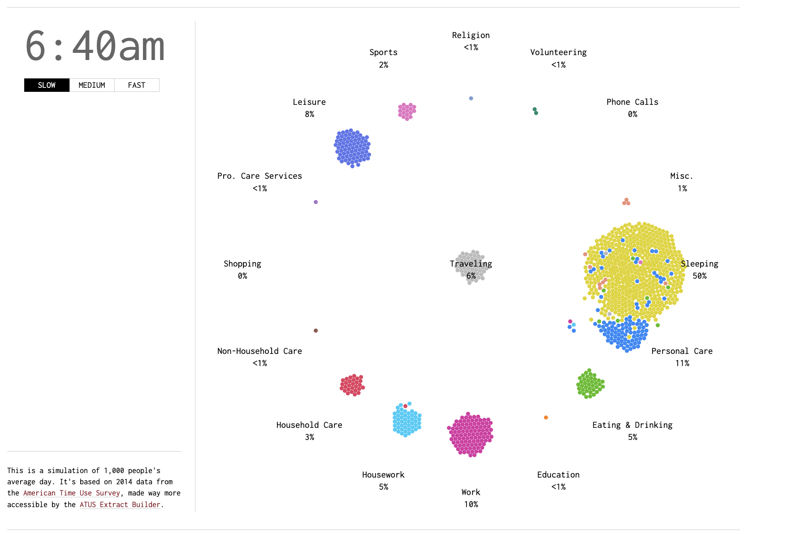

<!-- {:class="img-responsive"} -->

In a very well-done piece of data visualization showing the daily schedules of 1000 average Americans from [Flowing Data](https://flowingdata.com/2015/12/15/a-day-in-the-life-of-americans/), one learns that half of all Americans awake by 6:40. At MIT, the median sleep time is around 2-3AM, and attendance at 10AM classes is pretty spotty; average wakeup time is probably around 10:30 to 11:00. 

Why is this?

Clearly there's a generational disconnect here. Explaining why older people wake up around dawn is not too hard. They wake up early because they have to wake up early. But explaining why teenagers nowadays wake up later is much harder, and the oft-quoted "teenagers go to sleep later" due to pubescent hormones only has an effect of one to two hours (cite). 

This essay will first discuss the sleep schedules of three time periods of humanity, then explain why our sleep schedules consistently slide later, and finally propose a big-if-true idea of how to fix sleep schedules without needing to rely on alarms and corporate mandates.

We'll start by estabilishing a structure within which to think about sleep and circadian rhythym. Following in the steps of sleep research, we claim that the only things that really matter and consistently follow a 24-hour cycle are:
- light levels
- temperature

Then, we will, in order, consider three different kinds of lifestyles.
1. Early Industrial Society: Light and Heat are both scarce.
2. Hunter-Gatherer Society: Heat is more scarce.
3. Current Day: Neither are scarce.

Important timeline landmarks to have in mind are the sequential occurrences of:
- prehistoric: discovery of crude heating through fire
- 1883: the invention of the electric thermostat
- 1925: half of all homes switch over from gas lights/candles to electric power.

#### Early Industrial Society
In early industrial society, work is king. To work your 12-hour shifts, you need to be able to see. But getting light is hard! I mean come on, someone has to go out and slay sea leviathans for their blubber, and they'll want to be handsomely compensated.

Thus, you need to use all of the available light. This means being awake from dawn to dusk. Then, since the evening is more comfortable, we recover the traditional conceived sleep schedule from like 9PM to dawn.

#### Hunter Gatherers

I'll be mainly referencing a paper by *Yetish et al.* from 2015 published in [Cell](https://www.cell.com/current-biology/fulltext/S0960-9822(15)01157-4). Within this study, they aggregated collected sleep data from three Hunter-Gatherer societies: the Tsimane, Hadza, and San. The Tsimane are in South America, and the Hadza and San are in sub-Saharan Africa, with San being the furthest from the equator among all three tribes.

The sleep schedules for all of the tribes *broadly* goes along the lines of "go to sleep around 3 hours after sunset and wake up around sunrise." For all tribes, their bed time varies heavily, while their wakeup time remains highly consistent.

The most interesting data comes from the San, the southernmost tribe, who therefore have the largest seasonal shift. While other tribes always awake before dawn, for the San, it's seasonal: 
- Summer: Awake 1hr after sunrise. Go to sleep at 10:44PM
- Winter: Awaken before sunrise. Go to sleep at 9:16PM. 

The presence of heat as a relevant variable that changes throughout the year differentiates the San sleep schedule. The other two tribes always awake before dawn, whereas San wake up after sunrise in the summer. Additionally, the San sleep more in the winter than in the summer with the same absolute wakeup time but later bedtime (a heat-dependence that doesn't exist in modern Western society presumably due to central heating).

Most interestingly, the researchers found that the best way to predict wake up time is with the principle that **"wake onset occurred near the nadir (minimum) of the daily temperature rhythm"**. For context, the general temperature profile of Earth is that:
- Temperature spikes at Dawn
- Temperature slowly increases afterwards and peaks at 3PM, but is mostly flat from 10AM to 5PM
- Slow, gradual continuous decrease from 5PM to around dawn.

And this is why the San wake up later in the summer. Due to the solar schedule, the coldest time of the day gets shifted to after sunrise. An evolutionary explanation for why humans want to wake up when it's coldest is that we want to be asleep, with its associated decreased core temperature, during the coldest part of the night.

Strikingly, this tells us that in the pristine state of original humanity, the main signal we use for waking up is temperature. This also helps explain why Hunter-Gatherer bedtime varies so much; the temperature decrease at night is relatively continuous and nonabrupt, allowing for high variance in when this signal fully kicks in. A light-dominated sleep-signal would guarantee a consistent bedtime, but the hours-long-delay in melatonin precludes this.

### Modern Day
> Comfortable modern sleep is an unnatural superstimulus [(Alexey Guzey)](https://guzey.com/theses-on-sleep/#comfortable-modern-sleep-is-an-unnatural-superstimulus-sleepiness-just-like-hunger-is-normal). 

So what's up with our current sleep schedules. Well, nowadays, both light and heat are largely held constant, and this ends up applying constant delaying pressure to our circadian rhythym. Recall that the signals we used to rely on were from the 2x2 matrix of:
- (dawn, temp): the cold bite of pre-dawn
- (dawn, light): bright lights in our eyes
- (dusk, temp): decreasing night temperature
- (dusk, light): hours-delayed melatonin

And so essentially, all of these have been disturbed by modern life. Everyone already sorta knows about the light things -- we're not suppose to look at blue lights before going to bed, and sunrise lamps were quite chic a few years ago.

The heat side is an underdiscussed equal partner though. And in fact, as seen with the tribes, their wakeup time was almost entirely determined by subtle temperature changes their bodies sensed at the temperature nadir of the day -- even if this meant sometimes awakening before civil dawn in complete darkness and sometimes awakening an hour after sunrise.

#### Actionables

So, just maybe, the way to solve our messed up sleep schedules is temperature? Big if true at the very least. 

For the evening, it's already mostly solved. Anyone who's thought about sleep knows that getting a special chilled bed or setting the thermostat lowers helps a lot.

But, the truly missing square from the 2x2 matrix of (dawn/dusk, light/temperature) is the *temperature at dawn* category. Ironically, this was also **the strongest signal in hunter-gatherer sleep schedules** since their bedtimes varied heavily, with the main checkpoint being a consistent wakeup time which was determined by "waking up at the temperature minimum."

Thus, the main corollary of this systemization of what influences circadian rhythym is that we should experiment with using temperature to wake ourselves up. There's something to be said about this idea's similarity with the classic bucket of ice water to the face.

More tastefully though, it would be cool to set a consistent morning alarm where, instead of playing a sound, it would commit a tactical chilling through a smart mattress or a programmed temperature decrease setting in a thermostat.

Maybe I'll build this. But for now, I sleep.