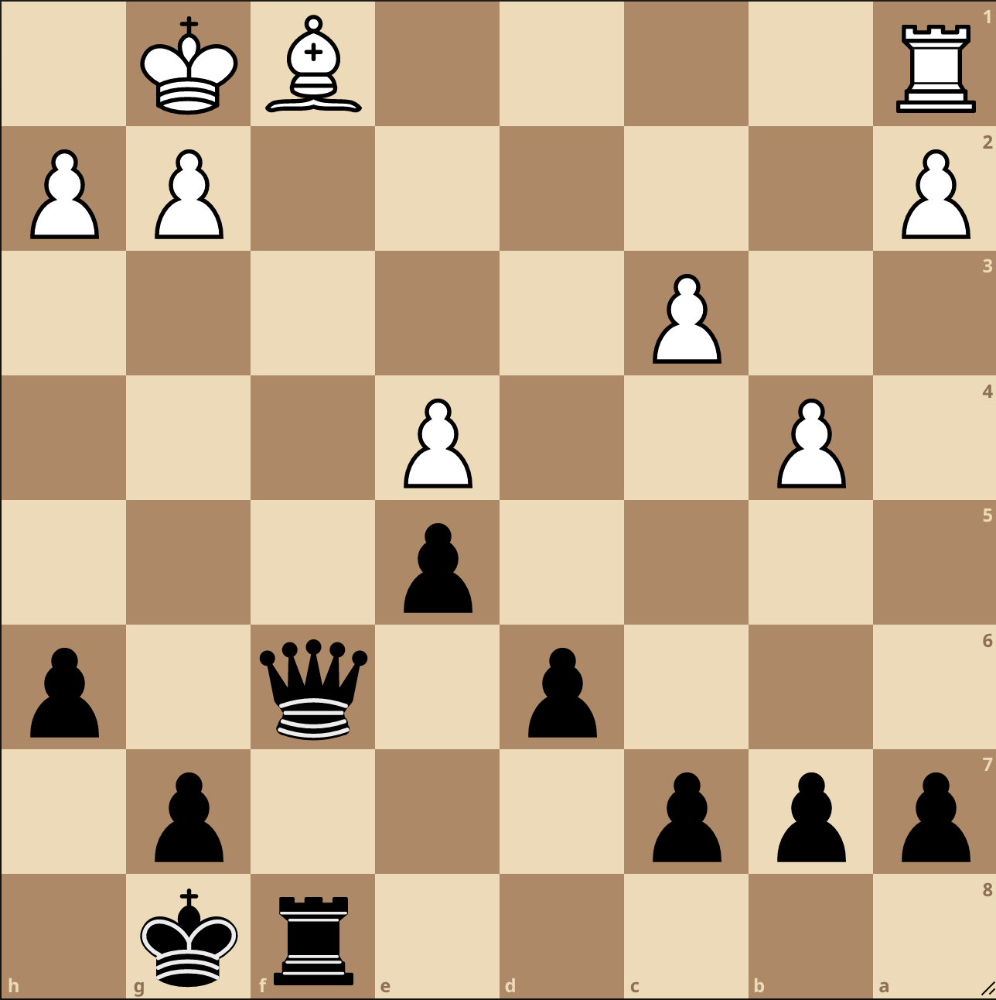
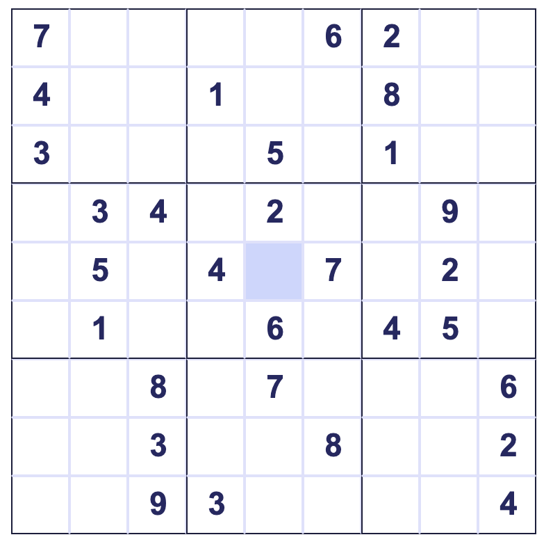

Welcome to the POTW! This ran for around a year in 2022, and I'm in the process of importing the past statements in, and building a second set of sites which will contain solutions that will be click-into-able-in-a-link-under-the-problem-statement (hopefully).


## Problems

### 1. Linguistics (David Garsten, adapted from Doris L Payne).
- October 27th, 2021

Tone is very important in the East African language Maasai. Vowels written with an acúte accent have high tone, those with a gràve accent have low tone, and those without an accent have mid tone. (Pronunciation guide: ɔ = “awe”, ɛ = “let”, ɪ = “bit”, ʊ = “hood”, ŋ = “song”)

Here are some sentences in Maasai:\\
1) éósh ɔlmʊraní ɔlásʊráɪ̀\\
2) áadɔ́l ɔlasʊráɪ́\\
3) áaósh ɔlmʊraní\\
4) ɪ́dɔ́l ɔlmʊránì\\
5) íóshokí ɔlmʊránì ɔlásʊráɪ̀\\
6) ádúŋokí ɔlmʊránì ɔlcɛtá\\
7) ádúŋ ɔlcɛtá\\
8) áaduŋokí ɔlmʊraní ɔlcɛtá\\
9) áadúŋ ɔlmʊraní\\
10) édúŋ ɔlmʊraní

Match them to their English translations:\\
A) The warrior cuts me.\\
B) The warrior cuts the tree for me.\\
C) The warrior cuts it.\\
D) I cut the tree for the warrior.\\
E) The warrior hits me.\\
F) You see the warrior.\\
G) The warrior hits the snake.\\
H) The snake sees me.\\
I) You hit the snake for the warrior.\\
J) I cut the tree.

### 2. Low-level Programming: Printing Numbers Without Typing Numbers
- November 8th

Using any language, write code that prints the numbers 1 to 20, each on separate lines, without using any numerical digit (0…9) in the actual code.
Output should look like:
```1
2
3
...
19
20```

### 3. Everybody can know after X calls (Ireland MO)
Each of $n$ members of a club is given a different item of information. The members are allowed to share the information, but, for security reasons, only in the following way: A pair may communicate by telephone. During a telephone call only one member may speak. The member who speaks may tell the other member all the information the speaker knows. Determine the minimal number of phone calls that are required to convey all the information to each of the members.

### 4. Fibonacci Numbers mod 10^9+7
Give the 5000th fibonacci number, modulo 10^9+7. 

Do not submit your full code. (Note: fib(1) = 1, fib(2) = 1, fib(3) = 2…)

### 5. Shooting over Two Fences
Two fences of height h_1 and h_2 (perpendicular segments to theg round) have distance d between the topmost points of the fences. 

Show the minimum speed required to throw a ball over both fences (with initial position/speed/angle varied) is v = sqrt(g(h_1+h_2+d)).

### 5. Don't Take This Red Pill
You have 100 different kinds of pills, 99 are harmless and 1 of them is poisonous. You wish to determine which type is poisonous. You have at your disposal an infinite supply of rabbits.

You may complete a single-day experiment. In the morning, you give each rabbit some set of pills and it eats all of them. Later that day, your research assistant will tell you which rabbits got poisoned.

What is the minimum number of participating rabbits needed to guarantee determining which type of pill is poisonous if you have:
(1) one of each kind of pill (1 point, ~1 jalapeno)
(2) two of each kind of pill (1 points, ~2.5 jalapeno)
(3) infinitely many of each kind of pill (1 points, ~2 jalapeno)

Bonus points if you submit a general formula. (n pills, k of each kind of pill, and a somewhat reasonable way to find the min # of rabbits needed)

### 8. Finding Local Minimum (1d gradient descent)
Given a list of N unique numbers, give an algorithm/method guaranteeing to find a local minimum (not absolute minimum) in time complexity < O(N). The time required to read in the list is ignored.

### 9. Binary Search with a Twist
Bob is thinking of a positive integer less than 100. Alice wants to figure out his number, and can ask him seven yes or no questions about it. However, once Bob has said no four times, he will feel too sad to answer any more questions. Show that Alice can always figure out Bob’s number. (submit what her first question should be)

### 10. Chess Puzzle #1



### 11. Sudoku Puzzle


### 12. Standard Deviation of Subarrays
Given an array of integers, explain how you could calculate the standard deviation of any subset in O(1) after doing an O(n) initial calculation. 

(Alternatively: You are given an array of integers. You are allowed to make calculations and store memory as you wish based on this array. Then, you will be given a random continuous subset of the array, and asked to find the standard deviation of the subset. A constraint is that you are not allowed to iterate over any arrays after being given the subset (making the time complexity O(1)). This means that no matter what subset you are given, you will be able to return the standard deviation in the same time complexity. What is the minimal amount of memory needed for your pre-calculations in order to find the standard deviation with this limitation? One way would be to calculate and store the standard deviation for every possible subset of the array using a large “answer key” array of size 2^n.)

### 13. David's Conlang
Dorini is my conlang. Ryan made me do this. One of the major components of Dorini sentence structure is “topic,” which marks the emphasized argument of the sentence. Below are some sentences in Dorini with their English translations. Topics are bolded.

1) Ryan explains math in the study room. ttumakuda Ryan rddarsuguda i duasiwo

2) My dog bites the teacher. lakiu dua ssi kobachin

3) The Assessment Team chases my friend. koba duakadu nri nkachin

4) Deven eats an eel because of my parrot. samo Deven rtunjoki wa ttumashi

5) Your teacher bites your friend’s meal in the dining hall. lakiu duamo samosiwo nri shiushiuda nkamo

6) The Assessment Team explains math. ttumakuda rddarsuguda ssi duakadu

7) JFK chases fish in the library. koba JFK shagushi i tikusiwo

8) The dining hall kills procrastination. waiha samosiwo nri rsurlarda

1. How would you say the following sentences in Dorini?
a) The teacher chases JFK because of procrastination. b) My dog kills math in the library study room.
c) My friend eats the eel.

Now look at the following question-answer dialogues. One answer has been translated for you.

9) i ji kasamo Neill kan Latin? kasamo Neill kan Latin i duasiwo (answer translation:) Neill thinks about Latin Club in the study room.

10) nri ji chishanji? chishanji nri jewokoba

11) kussu i kanda mi? rda, kussu i kanda

2. Based on these examples, translate the following responses into English, underlining focused elements, and saying what Dorini questions could have prompted them.

a) mana, mandua Michael nri rddarsuguda
b) amu shibi wa paqakadu
c) kaku ji amu machika ssi Sam


### 14. Distance From Edge
Given an equilateral triangle with side length 10, if you select a random point P in its interior, what is the range of possible values of the sum of the distances from the point to each side?

### 15. Blotto
This week’s POTW will be a Blotto round due at 11:59pm EST, February 13th, 2022. You will submit a list of nine non-negative integers that sum to 100 to either the bot or https://forms.gle/4qFr8iJfTEsZuN5w9. 

For example, “100 0 0 0 0 0 0 0 0” is a valid submission. All submissions will be played against each other and ranked based on the rules explained in the dropbox document. POTW points will be assigned based on the rankings.

Details about how matchups will be scored: https://www.dropbox.com/s/ou49kyfymf0td5k/Blotto_Round_1__BOTW_%20%282%29.pdf?dl=0

### 15.
### 16.
### 17.


### 31. Infinite Series (August 2nd, 2022)
Let X = (1-1/2)(1-1/4)(1-1/8)(1-1/16)(1-1/32)(1-1/64)(1-1/128)….. = prod_{n=1}^{infty} (1- 0.5^n).
You can easily get an upper bound by computing a few terms, but getting a lower bound is much harder. Find a lower bound on X and you will be scored based on the strength of the lower bound:
- X>0: 2 points
- X>=63/256: 3 points
- X>=1/4: 4 points
- X>=9/32: 5 points

You can use a calculator, but I’ll just tell you that X is approximately 0.28878.

*Remark (where this problem came from): In F_2, the probability that a NxN matrix with randomly selected entries is invertible is prod_{n=1}^{N} (1- 0.5^n)*